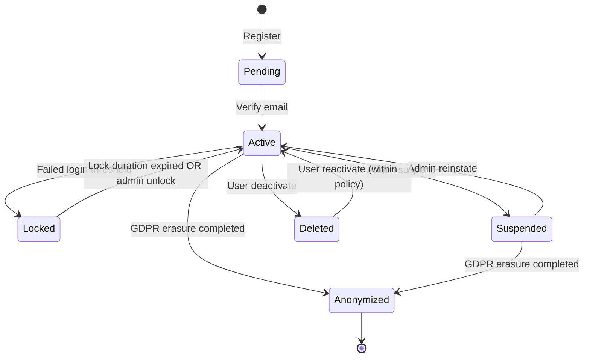
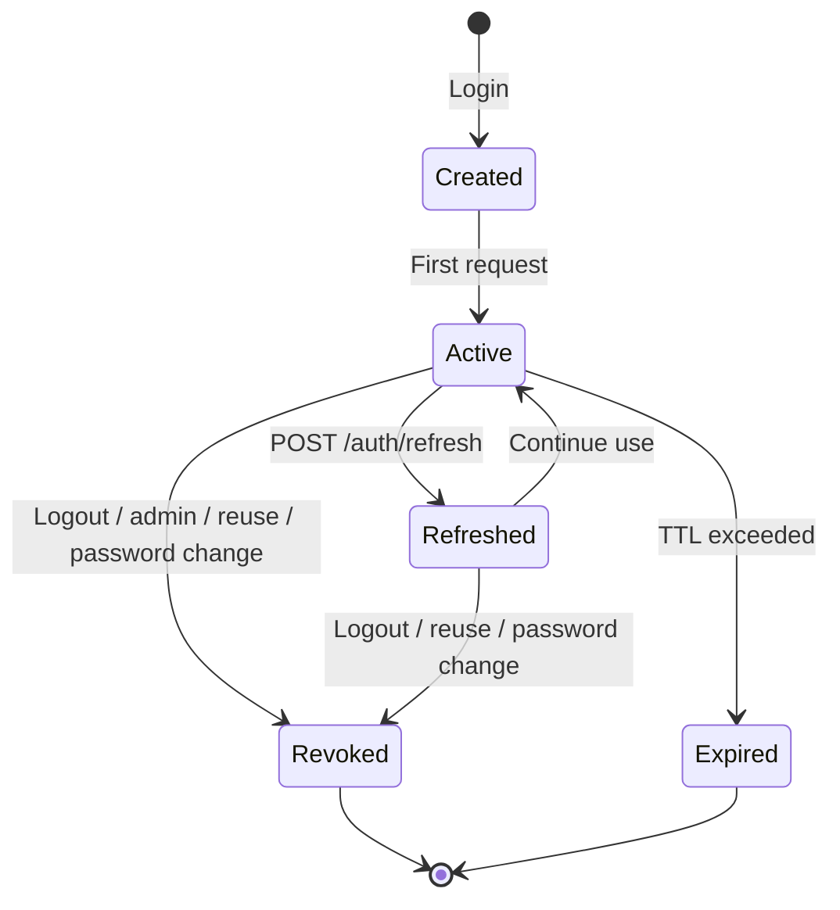
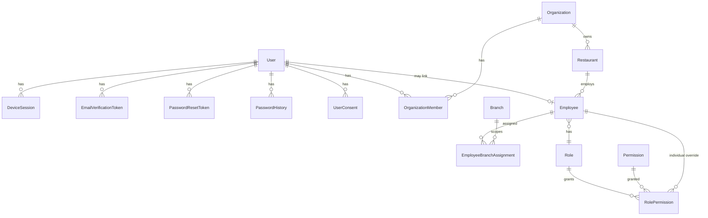
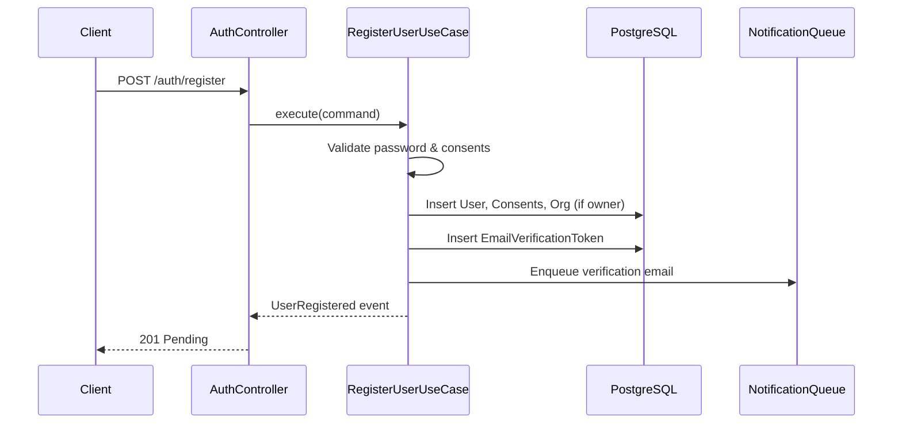
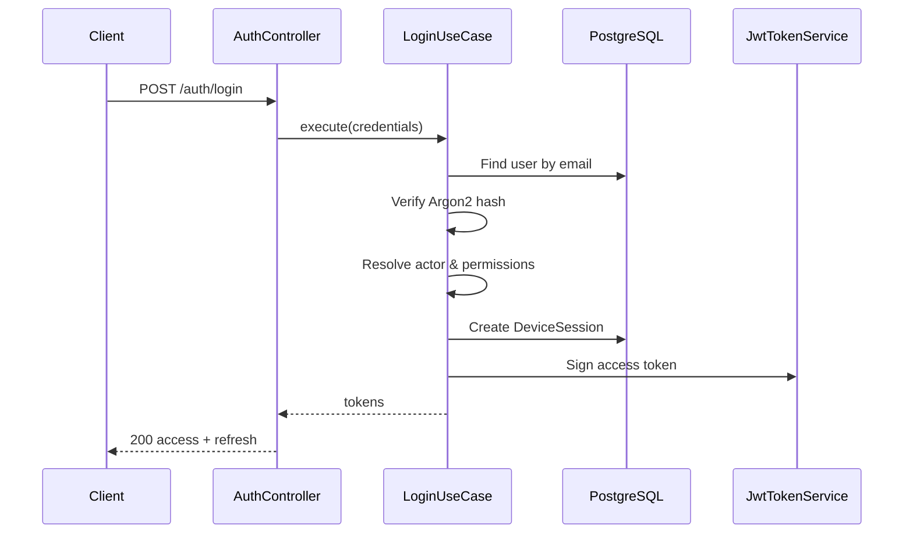
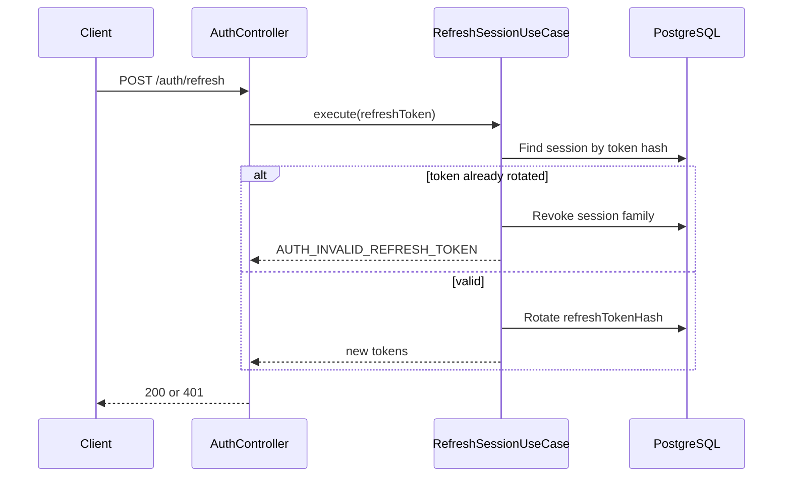
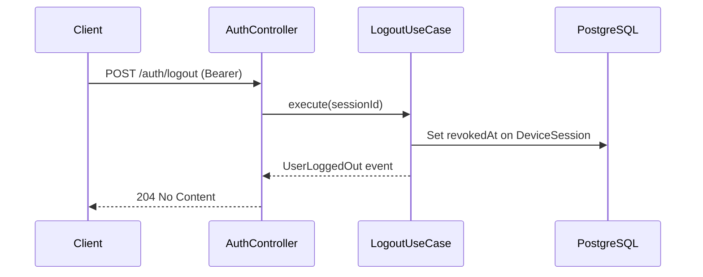
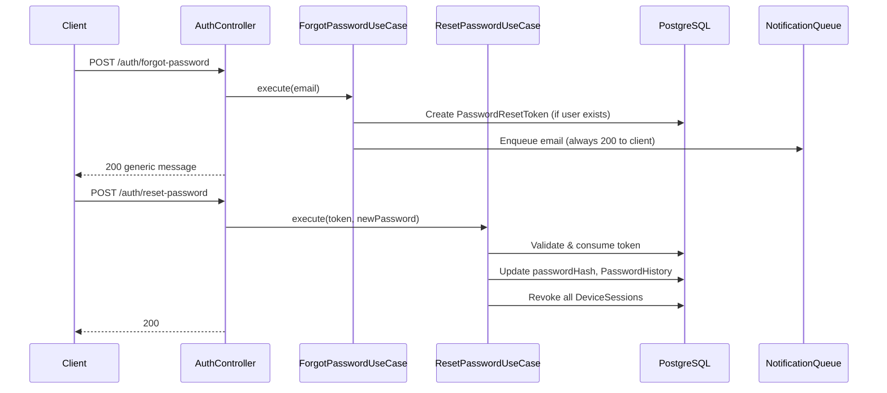

# AUTHENTICATION_ARCHITECTURE.md

# Enterprise Restaurant Reservation Platform

Version: 1.0  
Phase: **2.0 — Authentication Architecture** (documentation only; no implementation yet)

---

# Purpose

Authentication is the identity and credential layer of the platform. Every future module depends on it, but **authorization** (permissions, policies, scopes) is a separate concern — see **AUTHORIZATION_ARCHITECTURE.md** and ADR-017.

This document is the **single source of truth** for Phase 2 Authentication design (identity only). It must be approved before Authentication code is written.

Related documents:

| Document | Relationship |
|---|---|
| `AUTHORIZATION_ARCHITECTURE.md` | Permissions, policies, guards (ADR-017) |
| `DOMAIN_MODEL.md` | Business rules, aggregates, invariants |
| `DATABASE_SCHEMA.md` | Persistent schema (updated in Phase 2.0 to match this document) |
| `TENANCY.md` | Tenant context propagation after authentication |
| `DECISIONS.md` | ADR-016 (Authentication), ADR-017 (Authorization) |
| `EVENTS.md` | Authentication domain events |
| `API_GUIDELINES.md` | REST conventions and error codes |
| `NON_FUNCTIONAL_REQUIREMENTS.md` | Password policy, performance, security |
| `TESTING_STRATEGY.md` | Test tiers for Authentication |

---

# Architectural Principles

1. **Fail closed** — invalid, expired, or revoked credentials never degrade to anonymous access.
2. **Tenant context from token, never from client input** — `organizationId` in JWT claims is set server-side at login; request bodies/query params never override it (per TENANCY.md).
3. **Authentication ≠ Authorization** — this module proves identity and manages sessions only. Permission checks, policies, and scope guards belong to `authorization` (ADR-017, AUTHORIZATION_ARCHITECTURE.md). Tenant isolation is a third concern (TENANCY.md).
4. **Dual actor model** — the platform serves **Customers** (`User`) and **Staff** (`Employee` / `OrganizationMember`) through the same authentication module but different JWT claim shapes and guards.
5. **Refresh token rotation** — every refresh invalidates the previous refresh token; reuse of a rotated token revokes the entire session family (theft detection).
6. **No secrets in logs** — passwords, tokens, OTPs, and reset links are never logged (per CODING_STANDARDS.md).
7. **Clean Architecture** — Domain rules in Domain/Application layers; JWT, Argon2, Prisma, Redis in Infrastructure; Guards/Controllers in Presentation.

---

# Module Layout (Phase 2 Implementation Target)

```
apps/backend/src/modules/authentication/
├── domain/
│   ├── entities/           # User (auth slice), DeviceSession, EmailVerificationToken, TokenFamily, ...
│   ├── value-objects/      # Email, Password, RefreshTokenHash, IpAddress
│   ├── services/           # PasswordHasher (interface), TokenService (interface)
│   ├── events/             # UserRegistered, UserLoggedIn, ...
│   └── exceptions/         # InvalidCredentialsException, AccountLockedException, ...
├── application/
│   ├── use-cases/          # RegisterUser, Login, RefreshSession, ...
│   ├── ports/              # Repository interfaces, NotificationPort, ClockPort
│   └── dto/                # Application-level command/query objects
├── infrastructure/
│   ├── persistence/        # Prisma repositories
│   ├── security/           # Argon2PasswordHasher, JwtTokenService
│   └── redis/              # Rate-limit counters, login-attempt sliding windows
└── presentation/
    ├── controllers/        # AuthController
    ├── guards/             # JwtAuthGuard, SessionVersionGuard (identity only)
    └── dto/                # Request/Response DTOs (Swagger-decorated)

apps/backend/src/modules/authorization/    # See AUTHORIZATION_ARCHITECTURE.md
├── presentation/guards/                   # PermissionsGuard, BranchScopeGuard, ...
├── domain/policies/                       # ReservationPolicy, TablePolicy, ...
└── domain/services/                       # PermissionResolver, PolicyEngine
```

Supporting cross-cutting infrastructure (not owned by the Authentication module):

```
apps/backend/src/infrastructure/
└── tenancy/                # TenantContextService, TenantContextInterceptor (ADR-012)
```

`PlatformAdminGuard` and the rest of PlatformAdmin authentication/authorization live in `apps/backend/src/modules/platform-admin/` — implemented and live since Phase 2.23, not `infrastructure/` and not "(future)" (correcting a stale annotation from before that phase shipped). Cross-tenant access for PlatformAdmin/PlatformSupport uses Explicit Tenant Rebind or Tenant-Agnostic Raw Reader, not `$systemContext` — see TENANCY.md and ADR-035.

---

# 1. Authentication Flow

## 1.1 End-to-End Lifecycle (original Phase 2.0 diagram — the "Email Verification" step is superseded by ADR-022 for every actor; see §15)

```
Registration
    ↓
~~Email Verification (required before password login for email/password accounts)~~ — superseded: no actor in the current model has a mandatory email-verification step (Customer: phone/WhatsApp-verified instead, §15.1; Restaurant Owner: administratively provisioned, no verification step, §15.2)
    ↓
Login (credentials → access + refresh tokens)
    ↓
Authenticated Session (access token on each request)
    ↓
Refresh Token (silent renewal before access expiry)
    ↓
Logout (revoke current session)  OR  Session Revocation (admin/user/device)
```

## 1.2 Registration

**Actors:** Unauthenticated client.

**Outcomes (superseded by ADR-022, 2026-07-22 — see §15 for the authoritative current model):**

| Registration type | Creates | Notes |
|---|---|---|
| ~~Customer (`intent=customer`)~~ | ~~`User` (status `Pending`), `UserConsent` rows, verification token~~ | **Superseded by ADR-022** — customer registration is phone-first (username + E.164 phone, WhatsApp OTP via LightOTP per ADR-024); no email is collected; no `User` row exists until phone verification and password-setting both complete. See §15.1. |
| ~~Restaurant owner (`intent=owner`)~~ | ~~`User` (`Pending`), `Organization`, `OrganizationMember` (`Owner`), `UserConsent`, verification token~~ | **Superseded by ADR-022** — Restaurant Owners are no longer publicly self-registered. Accounts are provisioned administratively by a Platform Admin (email + password, no verification token, immediately `Active`). See §15.2. |
| Employee invite (Phase 6+) | Pre-created `Employee` linked on first login | Unchanged by ADR-022 — remains email-keyed (§15.5). Out of Phase 2 scope except schema readiness |

This table is retained (struck through, not deleted) per this project's ADR-immutability convention — it documents what Phase 2.0 originally specified before ADR-022.

**Rules:**

* Email must be unique among non-anonymized users — enforced by a database-level unique constraint on `users.email` (see DATABASE_SCHEMA.md), not by a check-then-insert existence check, since only a real constraint is race-safe against concurrent registrations. `RegisterOrganizationOwnerUseCase` relies on `UserRepository.save` translating the resulting constraint violation into `EmailAlreadyExistsException`. Compatible with ADR-014's anonymization mechanism, which rewrites `email` to a deterministic unique placeholder rather than leaving the original value in place.
* Password validated against policy (Section 8).
* `UserConsent` recorded for `TermsOfService` and `PrivacyPolicy` with version and IP — registration rejected if not accepted.
* Password hashed with Argon2id before persistence; plaintext never stored.
* Verification email queued via Notification module (fake provider in tests).
* `UserRegistered` event published.
* **No tokens issued at registration** — user must verify email first (reduces abuse of unverified accounts).

## 1.3 Email Verification (superseded consumer-wise by ADR-022 — mechanism retained in code, deprecation candidate)

**As of ADR-022 (2026-07-22), no actor in this system's approved model has a remaining legitimate use for this flow**: customers are phone/WhatsApp-verified instead (§15.1), and administratively-provisioned Restaurant Owners require no verification step at all (§15.2). `EmailVerificationToken`, `EmailVerificationRepository`, `EmailVerificationPolicy`, `VerifyEmailUseCase`, and `POST /auth/verify-email` are **not removed by ADR-022** (documentation/architecture change only) but are recorded as a **deprecation/removal candidate** for whichever future implementation phase executes ADR-022. The flow below is retained as historical record of the original Phase 2.0 design, not as an active requirement.

**Flow (as originally specified; no longer reachable by any approved registration path once ADR-022 ships):**

1. User clicks link containing opaque token (or submits token via API).
2. Server hashes token, looks up `EmailVerificationToken` by hash.
3. Validates: not expired, not consumed, matches user.
4. Sets `User.emailVerified = true`, `User.status = Active` (if not suspended/locked).
5. Marks token consumed.
6. Publishes `EmailVerified` (alias `UserVerified` in event catalog).
7. Returns success — client may proceed to login.

**Resend:** rate-limited; invalidates previous unconsumed tokens for same user; issues new token.

## 1.4 Login

**Preconditions (updated by ADR-022 — see §15.4 for the full split login model):**

* `User.status` must be `Active` (not suspended/locked/deleted) for either actor.
* **Restaurant Owner** (email + password): `emailVerified` precondition is **removed by ADR-022** — administratively-provisioned accounts are `Active` immediately, with no verification step to gate on.
* **Customer** (phone + password, ADR-022): gated on `phoneVerified`-equivalent state having been satisfied at registration `COMPLETE` time (§15.1) — enforced once, at account creation, not re-checked at every login the way `emailVerified` was.
* Credentials verified with constant-time comparison path (same error for wrong identifier vs wrong password), for both actor-specific login paths independently.

**Post-success:**

1. Resolve actor context (customer vs staff — see Section 2).
2. Create `DeviceSession` with hashed refresh token, device metadata, IP, user agent.
3. Issue access JWT + opaque refresh token.
4. Update `User.lastLoginAt`.
5. Publish `UserLoggedIn` + `SessionCreated`.
6. Write `AuditLog` (action: `auth.login.success`).

**Failed login:**

* Increment `LoginAttempt` counter (Redis + optional DB persistence).
* Lock account after threshold (Section 8).
* Publish audit event `auth.login.failed` (no user enumeration in response).
* Generic `401` with `AUTH_INVALID_CREDENTIALS`.

## 1.5 Refresh Token

**Flow:**

1. Client sends refresh token (body, never URL).
2. Server hashes token, finds `DeviceSession` by `refreshTokenHash`.
3. Validates: not revoked, not expired, session family not compromised.
4. **Rotates** refresh token: new hash stored, old hash invalidated.
5. Issues new access JWT (permissions re-embedded if `permissionsVersion` stale).
6. Updates `DeviceSession.lastUsedAt`.
7. Publishes `SessionRefreshed` (internal; optional in EVENTS.md).

**Reuse detection:** if a refresh token that was already rotated is presented, revoke all sessions in the `tokenFamilyId` and publish `SessionRevoked` with reason `token_reuse_detected`.

**OneSignal Identity Verification JWT (ADR-025 delivery, additive):** when the refreshed actor is a Customer (`actorType = User`), the refresh response also includes `onesignalIdentityToken: string | null` — a short-lived ES256 JWT for OneSignal's client SDK only. It is not a Tavola access/refresh token, carries no Tavola authorization claims, and is never accepted by any Tavola guard. Customers may also obtain a fresh token via `GET /api/v1/notifications/identity-token`. See ADR-025 and `API_GUIDELINES.md` Notification Endpoints.

**ADR-025 (OneSignal Identity Verification) — additive response field only:** for Customer (`User`) actors, successful `POST /auth/customer/login` and `POST /auth/refresh` also include `onesignalIdentityToken: string | null` (a short-lived ES256 JWT proving `external_id = User.id` ownership to OneSignal). This token carries **no** Tavola session/authorization semantics and is never accepted by any Tavola guard. On-demand refresh is `GET /notifications/identity-token`. See ADR-025 and `API_GUIDELINES.md`.

## 1.6 Authenticated Session

Every authenticated HTTP request:

```
Request + Authorization: Bearer <access_token>
    ↓
JwtAuthGuard — verify signature, expiry, issuer, audience
    ↓
Extract claims: sub, actorType, organizationId?, permissions?, sessionId
    ↓
TenantContextInterceptor — bind AsyncLocalStorage (TENANCY.md)
    ↓
PermissionsGuard (if @RequirePermission) — check claim permissions
    ↓
Controller → Use Case
```

WebSocket: same JWT at handshake; tenant context bound per event invocation (ADR-015).

## 1.7 Logout

**Single device:** revoke `DeviceSession` by `sessionId` from access token claims; idempotent.

**All devices:** increment `Users.sessionVersion`, revoke all `DeviceSession` rows for `userId`; publish `UserLoggedOut` with `scope=all`. See §4.5.

Refresh token invalidated immediately; access token remains valid until natural expiry (short TTL acceptable).

## 1.8 Session Revocation

**Triggers:**

| Trigger | Actor | Scope |
|---|---|---|
| User logout | Self | One or all sessions |
| User revokes device | Self | One session via `DELETE /auth/sessions/:id` |
| Password change | Self | All sessions except current (configurable) |
| Password reset completion | Self | All sessions |
| Admin suspends user | Platform/org admin | All sessions |
| Token reuse detected | System | Session family |
| Refresh token expiry | System | Single session |

All revocations set `DeviceSession.revokedAt` and append `AuditLog`.

---

# 2. Organization Ownership Model

## 2.1 Hierarchy

```
Platform (TAVLA)
    ↓
Organization  ← tenant boundary (ADR-011)
    ↓
Owner  ← exactly one OrganizationMember with role Owner (invariant)
    ↓
Organization Members  ← Admin, Billing, Staff (administrative RBAC)
    ↓
Restaurants  ← belong to Organization (Phase 4)
    ↓
Employees  ← operational staff, belong to one Restaurant
    ↓
Roles  ← Manager, Receptionist, … (operational RBAC)
    ↓
Permissions  ← granular capabilities
    ↓
Employee Branch Assignments  ← branch-scoped access
```

## 2.2 Ownership Rules

| Rule | Enforcement |
|---|---|
| Exactly one `Owner` per Organization at all times | `OrganizationMembershipService` invariant; DB partial unique index on `(organizationId) WHERE role = 'Owner' AND status = 'Active'` |
| Owner cannot be removed without transfer | `RemoveOrganizationMember` rejected for Owner |
| Ownership transfer is explicit | `OrganizationOwnershipTransferred` event; atomic swap Owner → new member |
| Organization created during owner registration | Same transaction as first `User` + `OrganizationMember` |
| `Owner` may also hold `Employee` record | Allowed but optional; org-admin actions use `OrganizationMember` role, operational actions use `Employee` RBAC |
| Employee belongs to exactly one Restaurant | FK constraint; tenant-scoped via `organizationId` on Restaurant |
| Employee with zero branch assignments | Restaurant-wide scope (all branches) |
| Employee with branch assignments | Restricted to listed branches only |
| Customer `User` has no Organization by default | JWT has no `organizationId`; may join orgs only as `OrganizationMember` or `Employee` |

## 2.3 Two RBAC Layers (Critical Distinction)

| Layer | Scope | Mechanism | Examples |
|---|---|---|---|
| **Organization administrative** | Organization | `OrganizationMember.role` enum | Manage billing, invite org admins, create restaurants |
| **Restaurant operational** | Restaurant / Branch | `Roles` + `Permissions` + `RolePermissions` + branch assignments | Approve reservations, manage tables, view reports |

These layers must never be conflated. A user with `OrganizationMember.role = Staff` does not automatically receive operational permissions — they need an `Employee` record with a resolved role.

## 2.4 Permission Resolution

**Moved to AUTHORIZATION_ARCHITECTURE.md** (ADR-017). Authentication embeds resolved permission claims in JWT at login/refresh; resolution rules, precedence, and policies are owned by the `authorization` module.

---

# 3. User Lifecycle

## 3.1 States

| Status | Meaning | Can login? | Transitions in |
|---|---|---|---|
| `Pending` | Registered, email not verified | No | Registration |
| `Active` | Verified, normal operation | Yes | Email verification, unlock |
| `Suspended` | Administratively disabled | No | Admin action, org suspension cascade |
| `Locked` | Temporarily locked (failed logins) | No | Brute-force policy; auto → `Active` after cooldown |
| `Deleted` | User-initiated deactivation (`deletedAt` set) | No | Account settings (Phase 3) |
| `Anonymized` | GDPR erasure complete (ADR-014) | No | Privacy flow; terminal |

**Note:** `emailVerified` boolean is retained alongside status for query efficiency; `Pending` implies `emailVerified = false`.

## 3.2 State Diagram



## 3.3 Lifecycle Rules

* Suspended Organization → all `OrganizationMember` staff JWTs invalidated; customer users unaffected unless they are org members.
* Password reset allowed for `Active` and `Locked` (not `Suspended`/`Deleted`/`Anonymized`).
* Email change (Phase 3) requires re-verification; status temporarily restricted.

---

# 4. Session Lifecycle

## 4.1 States

| State | Condition |
|---|---|
| `Created` | `DeviceSession` inserted, tokens issued |
| `Active` | Valid refresh token, not revoked, not expired |
| `Refreshed` | Refresh rotation occurred; new `refreshTokenHash` |
| `Revoked` | `revokedAt` set (logout, admin, reuse detection) |
| `Expired` | `expiresAt` passed without refresh |

## 4.2 State Diagram



## 4.3 Session Metadata

Each `DeviceSession` stores:

* `deviceName` (client-supplied, sanitized)
* `deviceType` (`mobile`, `web`, `tablet`, `unknown`)
* `ipAddress` (login IP; updated on refresh optional)
* `userAgent`
* `tokenFamilyId` (UUID — links rotation chain; see §4.4 Token Family)
* `permissionsVersion` (integer — snapshot at issue; authorization concern, compared on refresh)
* `sessionVersion` (integer — snapshot of `User.sessionVersion` at issue; see §4.5)

## 4.4 Token Family

A **Token Family** groups all refresh-token rotations that descend from a single login event. It is the unit of **replay-attack detection** and **compromise containment**.

### Structure

| Concept | Storage | Purpose |
|---|---|---|
| Token Family | `TokenFamilies` table (or `tokenFamilyId` as FK on `DeviceSession`) | Stable family identifier per login |
| Family root | First `DeviceSession` created at login | Parent of rotation chain |
| Rotation child | New `refreshTokenHash` on same `tokenFamilyId` | Normal refresh |
| Compromised family | `TokenFamilies.compromisedAt` set | All sessions in family revoked |

### Parent–Child Relationship

```
Login
  → creates TokenFamily (id = tokenFamilyId)
  → creates DeviceSession (refreshTokenHash v1)

Refresh
  → same tokenFamilyId
  → DeviceSession.refreshTokenHash updated v1 → v2 (v1 invalidated)

Replay attack (client presents v1 after v2 issued)
  → detect mismatch
  → revoke ALL DeviceSessions with tokenFamilyId
  → set TokenFamilies.compromisedAt
  → publish TokenReplayDetected + SessionFamilyRevoked
```

### Rotation Rules

1. Every successful refresh issues a new opaque refresh token and replaces `refreshTokenHash`.
2. Previous hash is not retained (cannot be reused).
3. `tokenFamilyId` never changes for the lifetime of that login chain.
4. Access token is re-issued on every refresh.

### Compromise Handling

When reuse is detected:

* Entire family revoked immediately (all rotation generations).
* User notified via `TokenReplayDetected` event (Notification module, Phase 9).
* Optional: increment `User.sessionVersion` to invalidate access tokens early (configurable via `SystemConfiguration.revokeAccessOnTokenReuse`).
* Audit log with `correlationId`, IP, user agent.

### Security Implications

* Stolen refresh token usable only until next legitimate refresh (or until expiry if victim inactive).
* Attacker and victim cannot both refresh indefinitely — first reuse after rotation trips detection.
* Does not replace `sessionVersion` global logout — families are per-device login; `sessionVersion` is per-user global.

## 4.5 Session Version

**Session Version** enables **O(1) "logout from all devices"** and global session invalidation without iterating every `DeviceSession` row.

### Mechanism

| Field | Location | Purpose |
|---|---|---|
| `sessionVersion` | `Users` table | Monotonic integer, starts at `1` |
| `sessionVersion` | JWT access token claim | Must match `Users.sessionVersion` |
| `sessionVersion` | `DeviceSession` snapshot | Audit trail at issue time |

### Lifecycle

```
User registers     → sessionVersion = 1
Login              → JWT carries sessionVersion = 1
Logout all         → Users.sessionVersion++ (now 2)
Any old JWT        → SessionVersionGuard rejects (claim 1 ≠ current 2)
New login          → JWT carries sessionVersion = 2
```

### When `sessionVersion` Is Incremented

| Event | Increment? |
|---|---|
| Logout (single device) | **No** — revoke that `DeviceSession` only |
| Logout all | **Yes** |
| Password change | **Yes** |
| Password reset complete | **Yes** |
| Admin force-logout user | **Yes** |
| Token family compromise (optional) | **Yes** (if `SystemConfiguration.revokeAccessOnTokenReuse`) |
| Permission change | **No** — use `permissionsVersion` instead |

### Synchronization

* `SessionVersionGuard` (Authentication) runs after `JwtAuthGuard`.
* Compares `jwt.sessionVersion` with `Users.sessionVersion` (Redis cache with DB fallback allowed; version mismatch always fails).
* Refresh token flow: if `sessionVersion` stale, refresh rejected even if `DeviceSession` still active.

### Security Implications

* Stolen access token invalidated on global logout without maintaining access-token blocklist.
* Combined with short access TTL (15m), maximum exposure window is bounded.
* Does not revoke refresh tokens alone — pair with `sessionVersion` increment (which rejects refresh via session check) **or** explicit `DeviceSession` bulk revoke on logout-all.
* **Logout-all implementation:** increment `sessionVersion` **and** set `revokedAt` on all active `DeviceSession` rows for defense in depth.

---

# 5. JWT Strategy

## 5.1 Token Types

| Token | Format | Lifetime | Storage (client) |
|---|---|---|---|
| **Access token** | Signed JWT (HS256 Phase 2; RS256 future) | 15 minutes (configurable) | Memory / Authorization header |
| **Refresh token** | Opaque 256-bit random, base64url | 30 days sliding (configurable) | Secure storage (mobile keychain; httpOnly cookie optional for web dashboard) |

Refresh tokens are **never** JWTs — only opaque identifiers hashed at rest.

## 5.2 Access Token Claims

**Customer (`actorType: User`):**

```json
{
  "sub": "<userId>",
  "actorType": "User",
  "sessionId": "<deviceSessionId>",
  "sessionVersion": 1,
  "tokenFamilyId": "<uuid>",
  "iat": 0,
  "exp": 0,
  "iss": "tavla-api",
  "aud": "tavla-clients"
}
```

**Employee (`actorType: Employee`):**

```json
{
  "sub": "<userId>",
  "actorType": "Employee",
  "employeeId": "<employeeId>",
  "organizationId": "<organizationId>",
  "restaurantId": "<restaurantId>",
  "branchIds": ["<uuid>", "..."],
  "permissions": ["reservations:approve", "tables:manage"],
  "permissionsVersion": 3,
  "sessionVersion": 1,
  "tokenFamilyId": "<uuid>",
  "sessionId": "<deviceSessionId>",
  "iat": 0,
  "exp": 0,
  "iss": "tavla-api",
  "aud": "tavla-clients"
}
```

**Organization member without Employee record (`actorType: OrganizationMember`):**

```json
{
  "sub": "<userId>",
  "actorType": "OrganizationMember",
  "organizationId": "<organizationId>",
  "orgRole": "Owner",
  "permissionsVersion": 1,
  "sessionVersion": 1,
  "tokenFamilyId": "<uuid>",
  "sessionId": "<deviceSessionId>"
}
```

**Platform admin (`actorType: PlatformAdmin`):** separate issuer/audience; minimal claims; never mixed with tenant tokens.

## 5.3 Rotation

See **§4.4 Token Family** for the full rotation, replay-detection, and compromise-handling model. Summary:

* Every `POST /auth/refresh` issues a new refresh token and invalidates the previous hash on the same `tokenFamilyId`.
* Presenting a superseded refresh token → revoke entire family + security events.

## 5.4 Revocation

* Access tokens are not blocklisted in Phase 2 (rely on short TTL).
* Refresh revocation is immediate via `DeviceSession.revokedAt`.
* Future: Redis denylist for access tokens only if compliance requires instant access revocation before expiry.

## 5.5 Expiration

| Token | Default | Config key |
|---|---|---|
| Access | 15m | `JWT_ACCESS_EXPIRY` |
| Refresh | 30d | `JWT_REFRESH_EXPIRY` |
| Email verification | 24h | `SystemConfiguration.emailVerificationTokenTtlHours` |
| Password reset | 1h | `SystemConfiguration.passwordResetTokenTtlHours` |

## 5.6 Signing

* **Phase 2:** HS256 with `JWT_ACCESS_SECRET` and separate `JWT_REFRESH_SECRET` (refresh validation uses DB lookup, not JWT — second secret used for future split or HMAC of opaque tokens if needed).
* **Signing implementation:** `JwtTokenService` in Infrastructure; Domain depends on `TokenService` port only.
* **Key rotation:** support `JWT_ACCESS_SECRET_PREVIOUS` for 24h overlap; `kid` header in JWT for multi-key (Phase 2 documents; implementation in step 2.8).

## 5.7 Permissions Version (Authorization)

Permission embedding in JWT is an **authentication transport** concern; resolution rules live in **AUTHORIZATION_ARCHITECTURE.md §17**.

* `permissionsVersion` claim embedded at login/refresh by Authentication after calling `PermissionResolver`.
* Authentication does not interpret permissions — it only carries claims produced by Authorization.

## 5.8 Session Version (Authentication)

See **§4.5**. `sessionVersion` claim validated by `SessionVersionGuard` — purely an identity/session concern.

---

# 6. RBAC & Authorization (Moved)

**RBAC, policies, guards, scope resolution, and permission precedence are defined in `AUTHORIZATION_ARCHITECTURE.md` (ADR-017).**

Authentication issues JWTs containing claims produced by the Authorization layer at login/refresh time. It does not evaluate permissions.

---

# 7. Database Design

## 7.1 Entity Relationship Overview



## 7.2 Users (extensions for Phase 2)

Existing table plus:

| Field | Type | Purpose |
|---|---|---|
| `status` | enum | `Pending`, `Active`, `Suspended`, `Locked`, `Deleted`, `Anonymized` (replaces boolean-only model) |
| `emailVerified` | boolean | Fast verification check |
| `failedLoginCount` | int | Rolling window counter (also in Redis) |
| `lockedUntil` | timestamp nullable | Auto-unlock time |
| `permissionsVersion` | int | JWT staleness detection |
| `passwordChangedAt` | timestamp | Policy enforcement |

Indexes: existing `email`, `phone`; add `(status)` for admin queries.

## 7.3 Device Sessions

Existing table plus:

| Field | Type | Purpose |
|---|---|---|
| `tokenFamilyId` | UUID | Rotation / reuse detection |
| `permissionsVersion` | int | Snapshot at issue time |
| `revokedReason` | string nullable | `logout`, `reuse_detected`, `password_change`, `admin` |

Constraint: `refreshTokenHash` unique (existing).

## 7.4 Email Verification Tokens (new)

| Field | Type | Notes |
|---|---|---|
| `id` | UUID | PK |
| `userId` | UUID | FK → Users |
| `tokenHash` | string | SHA-256 of opaque token; unique |
| `expiresAt` | timestamp | |
| `consumedAt` | timestamp nullable | |
| `createdAt` | timestamp | |

Indexes: `tokenHash` unique; `userId`; `(userId) WHERE consumedAt IS NULL`.

## 7.5 Password Reset Tokens (new)

| Field | Type | Notes |
|---|---|---|
| `id` | UUID | PK |
| `userId` | UUID | FK → Users |
| `tokenHash` | string | unique |
| `expiresAt` | timestamp | |
| `consumedAt` | timestamp nullable | |
| `createdAt` | timestamp | |

## 7.6 Password History (new)

| Field | Type | Notes |
|---|---|---|
| `id` | UUID | PK |
| `userId` | UUID | FK → Users |
| `passwordHash` | string | Previous Argon2 hash |
| `createdAt` | timestamp | |

Retention: last 5 passwords (configurable via `SystemConfiguration.passwordHistoryCount`).

## 7.7 Login Attempts (new)

| Field | Type | Notes |
|---|---|---|
| `id` | UUID | PK |
| `identifier` | string | Email attempted (indexed) |
| `ipAddress` | string | |
| `success` | boolean | |
| `failureReason` | string nullable | |
| `createdAt` | timestamp | |

Redis sliding window for rate limiting; DB for audit and suspicious-login analysis.

## 7.8 Roles (complete schema)

| Field | Type | Notes |
|---|---|---|
| `id` | UUID | PK |
| `name` | string | unique |
| `slug` | string | unique |
| `description` | string | |
| `scope` | enum | `Platform`, `Restaurant` |
| `createdAt` | timestamp | |
| `updatedAt` | timestamp | |

Seed: Manager, Receptionist, Cashier, … — not org Owner (that's `OrganizationMember`).

## 7.9 Permissions (complete schema)

| Field | Type | Notes |
|---|---|---|
| `id` | UUID | PK |
| `slug` | string | unique, e.g. `reservations:approve` |
| `description` | string | |
| `createdAt` | timestamp | |

## 7.10 Role Permissions (unchanged semantics)

See DATABASE_SCHEMA.md — supports `RoleGrant`, `IndividualGrant`, `IndividualRevocation`.

## 7.11 Platform Admins (new)

| Field | Type | Notes |
|---|---|---|
| `id` | UUID | PK |
| `userId` | UUID | FK → Users, unique |
| `createdAt` | timestamp | |
| `revokedAt` | timestamp nullable | |

## 7.12 SystemConfiguration Integration

| Key | Default | Purpose |
|---|---|---|
| `emailVerificationTokenTtlHours` | 24 | Verification link lifetime |
| `passwordResetTokenTtlHours` | 1 | Reset link lifetime |
| `passwordHistoryCount` | 5 | Reuse prevention |
| `maxFailedLoginAttempts` | 5 | Before lock |
| `accountLockDurationMinutes` | 30 | Auto-unlock |
| `maxActiveSessionsPerUser` | 10 | Concurrent session cap |
| `refreshTokenTtlDays` | 30 | Session lifetime |

Read via typed config at startup; changes take effect without redeploy.

## 7.13 Soft Delete Strategy

| Entity | Soft delete? | Notes |
|---|---|---|
| User | `deletedAt` + status `Deleted` | Anonymization is separate (ADR-014) |
| DeviceSession | `revokedAt` | Not soft-delete — revocation timestamp |
| EmailVerificationToken | No | Expire + consume |
| PasswordResetToken | No | Expire + consume |
| Organization | `deletedAt` | Existing |
| Employee | `deletedAt` | Existing |

## 7.14 Constraints Summary

* `OrganizationMember`: unique `(organizationId, userId)`; partial unique one Owner per org.
* `DeviceSession`: unique `refreshTokenHash`.
* `EmailVerificationToken` / `PasswordResetToken`: unique `tokenHash`.
* `EmployeeBranchAssignment`: unique `(employeeId, branchId)`.
* `RolePermissions`: partial uniques per type (existing).

---

# 8. Security

## 8.1 Password Hashing

* **Algorithm:** Argon2id (ADR-016).
* **Parameters:** from env — `ARGON2_MEMORY_COST`, `ARGON2_TIME_COST`, `ARGON2_PARALLELISM` (NON_FUNCTIONAL_REQUIREMENTS.md).
* **Port:** `PasswordHasher` interface in Domain; `Argon2PasswordHasher` in Infrastructure.

## 8.2 Brute-Force Protection

| Control | Implementation |
|---|---|
| Per-email lockout | After `maxFailedLoginAttempts` → `status = Locked`, `lockedUntil` set |
| Per-IP rate limit | Redis sliding window on `login` endpoint |
| Global auth rate limit | Nginx + application `@Throttle()` |
| Constant-time response | Same 401 message for bad email vs bad password |
| Login attempt logging | `LoginAttempt` table + structured logs |

## 8.3 Rate Limiting

| Endpoint group | Limit (default) | Config |
|---|---|---|
| `POST /auth/register` | 5 / hour / IP | `RATE_LIMIT_AUTH_*` |
| `POST /auth/login` | 10 / 15min / IP | |
| `POST /auth/forgot-password` | 3 / hour / email | |
| `POST /auth/resend-verification` | 3 / hour / user | |
| `POST /auth/refresh` | 30 / min / session | |

Returns `429 Too Many Requests` with `RATE_LIMIT_EXCEEDED`.

## 8.4 Device Fingerprint

* Client sends `X-Device-Id` (optional UUID) + `X-Device-Name`.
* Stored on `DeviceSession`; used for session list UI and suspicious-login heuristics.
* Not used as sole authentication factor in Phase 2.

## 8.5 Refresh Token Theft Detection

* Rotation + `tokenFamilyId` reuse detection (Section 5.3).
* Alert: `SessionRevoked` event with `reason=token_reuse_detected`; optional notification to user (Phase 9).

## 8.6 Concurrent Session Handling

* Default max 10 active sessions per user (`SystemConfiguration`).
* New login beyond cap → revoke oldest `DeviceSession` by `lastUsedAt` (configurable policy: reject instead).

## 8.7 Password History

* Cannot reuse last N password hashes (Section 7.6).
* Checked on change-password and reset-password.

## 8.8 Password Policy

Per NON_FUNCTIONAL_REQUIREMENTS.md:

* Minimum 12 characters.
* Uppercase, lowercase, number, special character.
* Validated in Domain `Password` value object.

## 8.9 Email Verification Policy (superseded by ADR-022 — no remaining consumer, see §1.3 and §15.6)

* ~~Required before first login for email/password accounts.~~ **No email/password actor in the current model requires this as of ADR-022**: Restaurant Owner accounts (the only remaining email/password actor) are administratively provisioned and immediately `Active`, with no verification step.
* Social login (future) may auto-verify — out of Phase 2 scope; unaffected by ADR-022.

## 8.10 Session Revocation

See Section 1.8.

## 8.11 IP Logging

* `LoginAttempt.ipAddress`
* `DeviceSession` login IP
* `AuditLog.ipAddress`
* `UserConsent.ipAddress`

Never log IP in client-facing error messages.

## 8.12 User Agent Tracking

Stored on `DeviceSession`; displayed in session management UI (Phase 3).

## 8.13 Suspicious Login Detection

**Phase 2 (basic):** new IP + new device fingerprint → publish `SuspiciousLoginDetected` (internal) + audit log.

**Future:** geo-velocity, impossible travel, notification to user.

---

# 9. API Design

Base path: `/api/v1/auth`  
All endpoints versioned per API_GUIDELINES.md.  
Authenticated endpoints: `Authorization: Bearer <access_token>`.

## 9.1 Endpoint Catalog

**Original Phase 2.0 catalog (`/auth/register` row superseded by ADR-022 — see §15.7 for the frozen post-ADR-022 catalog; all other rows below remain accurate and unaffected):**

| Method | Path | Auth | Description |
|---|---|---|---|
| POST | ~~`/auth/register`~~ | Public | ~~Register customer or owner~~ — **retired (Phase 2.23)**: this endpoint and `RegisterOrganizationOwnerUseCase` are removed from the codebase entirely. Owner accounts are now provisioned exclusively via `POST /platform-admin/restaurant-owners` (§15.2, §15.8). |
| POST | ~~`/auth/verify-email`~~ | Public | ~~Consume verification token~~ — **retired (Phase 2.23)**: this endpoint, `VerifyEmailUseCase`, and the `EmailVerificationToken` table are removed entirely. No surviving actor needs email verification. |
| POST | `/auth/resend-verification` | Public | Resend verification email — never implemented (§ "Implementation Plan"); moot under ADR-022. |
| POST | `/auth/login` | Public | Email/password login — **remains the Restaurant Owner/staff login path unchanged** (§15.4). |
| POST | `/auth/refresh` | Refresh token | Rotate tokens |
| POST | `/auth/logout` | Bearer | Revoke current session |
| POST | `/auth/logout-all` | Bearer | Revoke all sessions |
| POST | `/auth/forgot-password` | Public | Request reset email |
| POST | `/auth/reset-password` | Public | Consume reset token + new password |
| POST | `/auth/change-password` | Bearer | Change password (authenticated) |
| GET | `/auth/sessions` | Bearer | List device sessions |
| DELETE | `/auth/sessions/:sessionId` | Bearer | Revoke specific session |
| GET | `/auth/me` | Bearer | Minimal identity (full profile = Phase 3) |

## 9.2 Request / Response DTOs

### POST `/auth/register`

**Request:**

```json
{
  "intent": "customer",
  "email": "user@example.com",
  "password": "SecurePass1!",
  "firstName": "Jane",
  "lastName": "Doe",
  "phone": "+963900000000",
  "consents": {
    "termsOfService": true,
    "privacyPolicy": true,
    "marketing": false
  },
  "organizationName": "Optional for owner intent"
}
```

**Response `201`:**

```json
{
  "success": true,
  "message": "Registration successful. Please verify your email.",
  "data": {
    "userId": "uuid",
    "email": "user@example.com",
    "status": "Pending"
  },
  "meta": {}
}
```

### POST `/auth/login`

**Request:**

```json
{
  "email": "user@example.com",
  "password": "SecurePass1!",
  "deviceName": "iPhone 15",
  "deviceType": "mobile"
}
```

**Response `200`:**

```json
{
  "success": true,
  "message": "Login successful.",
  "data": {
    "accessToken": "eyJ...",
    "refreshToken": "opaque...",
    "expiresIn": 900,
    "tokenType": "Bearer",
    "actorType": "User"
  },
  "meta": {}
}
```

### POST `/auth/refresh`

**Request:**

```json
{
  "refreshToken": "opaque..."
}
```

**Response `200`:** same shape as login tokens.

### POST `/auth/change-password`

**Response `200`:**

```json
{
  "success": true,
  "message": "Password changed successfully.",
  "data": {
    "message": "Password changed successfully.",
    "sessionVersion": 2,
    "accessToken": "eyJ...",
    "accessTokenExpiresAt": "2026-07-11T00:15:00.000Z"
  },
  "meta": {}
}
```

Per §1.8/§4.5, password change preserves the caller's current `DeviceSession` (only *other* sessions are revoked) but still bumps `User.sessionVersion` — which would otherwise invalidate the very access token used to make this call on the next request. `accessToken` is a freshly signed token carrying the updated `sessionVersion` for the same session/token family, so the caller does not need to make a separate `/auth/refresh` call to keep working. The refresh token is unchanged (not rotated) since the underlying `DeviceSession` was not revoked or superseded.

### GET `/auth/me`

**Response `200`:**

```json
{
  "success": true,
  "message": "Request successful.",
  "data": {
    "userId": "uuid",
    "email": "user@example.com",
    "actorType": "Employee",
    "organizationId": "uuid",
    "permissions": ["reservations:approve"]
  },
  "meta": {}
}
```

## 9.3 Validation Rules

* All DTOs use `class-validator` + global ValidationPipe (whitelist, forbidNonWhitelisted).
* Email: RFC 5322 subset via custom `@IsEmail()` + normalization (lowercase trim).
* Password: domain `Password` VO rules.
* ~~`intent`: enum `customer` | `owner`.~~ **Superseded by ADR-022**: there is no longer a single shared public registration endpoint with an `intent` discriminator. Customer registration and Owner provisioning are two structurally distinct flows with no shared DTO (§15).

## 9.4 HTTP Status Codes

| Situation | Status | Code |
|---|---|---|
| Success register | 201 | — |
| Success login/refresh | 200 | — |
| Validation error | 400 | `VALIDATION_ERROR` |
| Invalid credentials | 401 | `AUTH_INVALID_CREDENTIALS` |
| Expired access token | 401 | `AUTH_EXPIRED_TOKEN` |
| Invalid refresh token | 401 | `AUTH_INVALID_REFRESH_TOKEN` |
| Email not verified | 403 | `AUTH_EMAIL_NOT_VERIFIED` |
| Account locked/suspended | 403 | `AUTH_ACCOUNT_LOCKED` / `AUTH_ACCOUNT_SUSPENDED` |
| Permission denied | 403 | `FORBIDDEN` |
| Rate limited | 429 | `RATE_LIMIT_EXCEEDED` |

## 9.5 Swagger Requirements

Every endpoint: `@ApiTags('Authentication')`, `@ApiOperation`, `@ApiResponse` for success and error cases, request body examples, `@ApiBearerAuth()` on protected routes.

---

# 10. Events

## 10.1 Authentication Events (canonical)

| Event | Trigger | Consumers |
|---|---|---|
| `UserRegistered` | Registration complete | Notification, Audit |
| `UserVerified` | Email verified | Analytics |
| `UserLoggedIn` | Successful login | Audit, Analytics |
| `UserLoggedOut` | Logout | Audit |
| `SessionCreated` | New DeviceSession | Audit |
| `SessionRefreshed` | Token rotation | Metrics (optional) |
| `SessionRevoked` | Logout, reuse, admin | Audit, Notification |
| `PasswordChanged` | User changed password | Notification, Audit, revoke sessions |
| `PasswordResetRequested` | Forgot password | Notification, Audit |
| `PasswordResetCompleted` | Reset consumed | Audit, revoke sessions |
| `RoleAssigned` | Employee role change | Invalidate permissionsVersion |
| `PermissionGranted` | Individual grant | Invalidate permissionsVersion |
| `PermissionRevoked` | Individual revocation | Invalidate permissionsVersion |
| `SuspiciousLoginDetected` | Heuristic match | Audit, Notification (future) |

## 10.2 Event Payload (minimum)

```json
{
  "eventId": "uuid",
  "eventName": "UserLoggedIn",
  "timestamp": "ISO-8601",
  "correlationId": "uuid",
  "actor": { "userId": "uuid", "actorType": "User" },
  "resourceId": "deviceSessionId",
  "payload": {}
}
```

## 10.3 Publishing

* Application layer publishes via `DomainEventPublisher` port.
* BullMQ for async handlers (email dispatch).
* Socket.IO does **not** broadcast auth events to clients (security).

---

# 11. Sequence Diagrams

## 11.1 Registration



## 11.2 Login



## 11.3 Refresh



## 11.4 Logout



## 11.5 Password Reset



---

# 12. Threat Model

## 12.1 Attack Vectors & Mitigations

| Threat | Mitigation | Residual risk |
|---|---|---|
| Credential stuffing | Rate limit, lockout, generic errors | Distributed low-volume attacks |
| Password spraying | Per-IP limits, alerting | Shared NAT false positives |
| JWT theft (XSS) | Short access TTL; refresh rotation | XSS in client app |
| Refresh token theft | Rotation + reuse detection | Theft before first refresh |
| Session fixation | New session on login; no pre-auth session IDs | — |
| User enumeration (register) | Generic responses where required | Timing side channels — mitigate with constant work |
| User enumeration (login) | Same error message | — |
| CSRF on cookie-based refresh | Phase 2: body token preferred; SameSite if cookies added | Cookie mode in Phase 2.5+ |
| Privilege escalation | Permissions in JWT from server resolver only | Stale permissions ≤15 min |
| Cross-tenant access | organizationId from JWT; TENANCY.md extension | Bug in extension — tested in CI |
| IDOR on sessions | Revoke only own sessions | — |
| Email verification bypass | Hashed single-use tokens | — |
| Reset token brute force | High-entropy token, rate limit, short TTL | — |
| Insider (platform admin) | Audited Explicit Tenant Rebind / Tenant-Agnostic Raw Reader (ADR-035); two-tier `PlatformAdmin`/`PlatformSupport` role (ADR-034 §11) | Operational trust |

## 12.2 Remaining Risks

* Access token valid until expiry after password change (mitigated by short TTL + session revoke on refresh).
* No hardware MFA in Phase 2 (future).
* No WebAuthn/passkeys (future).
* Geo-IP suspicious login is heuristic only.

---

# 13. Testing Strategy

## 13.1 Unit Tests

| Target | Examples |
|---|---|
| `Password` value object | Policy validation |
| `RegisterUserUseCase` | Duplicate email, missing consent |
| `LoginUseCase` | Wrong password, locked account, unverified |
| `RefreshSessionUseCase` | Rotation, reuse detection |
| `PermissionResolver` | Grants, revocations, branch scope (authorization module) |
| `PasswordHasher` | Mock port; Argon2 tested in integration |

## 13.2 Integration Tests

| Target | Examples |
|---|---|
| `UserRepository` | Unique email constraint |
| `DeviceSessionRepository` | Unique refreshTokenHash |
| `EmailVerificationTokenRepository` | Expiry, consume idempotency |
| Token reuse | Two parallel refresh with same token → family revoked |
| `LoginAttempt` + lockout | 5 failures → Locked status |

Real PostgreSQL via Docker Compose (TESTING_STRATEGY.md).

## 13.3 E2E Tests

| Workflow | Steps |
|---|---|
| Register → verify → login | Full happy path |
| Login → refresh → access protected route | Token chain |
| Logout → refresh fails | Revocation |
| Forgot → reset → login with new password | |
| Owner registration | User + Organization + Owner member created |
| Permission change | Role change → refresh → new permissions in JWT |

Fake notification provider; no real email.

## 13.4 Security Testing

* OWASP ZAP baseline on `/auth/*` (CI nightly).
* Verify no tokens in logs (grep test).
* JWT alg none attack rejected.
* Expired token rejected.
* Tampered signature rejected.

## 13.5 Load Testing

* Target: 100 logins/second sustained (NON_FUNCTIONAL_REQUIREMENTS.md baseline).
* k6 script in Phase 2.9+ against staging.
* Argon2 parameters tuned to prevent CPU exhaustion under load.

---

# 14. Implementation Plan

Each step is independently testable and mergeable. **No step begins until Phase 2.0 architecture is approved.**

| Step | ID | Deliverable | Tests |
|---|---|---|---|
| 1 | **2.1** | Prisma migrations: auth tables + User extensions | Migration integration |
| 2 | **2.2** | Seed: Roles, Permissions, RolePermissions, SystemConfiguration auth keys | Seed verification |
| 3 | **2.3** | Domain: Password VO, auth exceptions, ports | Unit |
| 4 | **2.4** | Infrastructure: Argon2PasswordHasher, JwtTokenService | Integration |
| 5 | **2.5** | RegisterUser use case + POST `/auth/register` | Unit + E2E |
| 6 | **2.6** | Email verification + resend | Unit + E2E |
| 7 | **2.7** | Login + DeviceSession creation | Unit + E2E |
| 8 | **2.8** | Refresh rotation + reuse detection | Integration + E2E |
| 9 | **2.9** | Logout + logout-all + list/revoke sessions | E2E |
| 10 | **2.10** | Forgot/reset/change password + PasswordHistory | E2E |
| 11 | **2.11** | JwtAuthGuard + @CurrentUser decorator | E2E |
| 12 | **2.12** | TenantContextInterceptor integration (TENANCY.md) | Integration |
| 13 | **2.13** | `PermissionResolver` + permissions in JWT (authorization module) | Unit + Integration |
| 14 | **2.14** | `PermissionsGuard` + `@RequirePermission` (authorization module) | E2E |
| 15 | **2.15** | Rate limiting (Redis) on auth endpoints | Integration |
| 16 | **2.16** | Brute-force lockout + LoginAttempt persistence | Integration |
| 17 | **2.17** | Audit log writes for auth actions | Integration |
| 18 | **2.18** | Domain event publishing (auth events) | Unit + Integration |
| 19 | **2.19** | Owner registration flow (User + Organization + Owner) | E2E |
| 20 | **2.20** | Swagger complete + API_GUIDELINES error codes | Manual + contract |
| 21 | **2.21** | Security test suite + load smoke | CI |

**Phase 2 exit criteria:** steps 2.1–2.21 complete, E2E auth workflows green, TENANCY.md integration tests pass, documentation updated.

---

# 15. Phone-First Customer Registration & Administratively-Provisioned Restaurant Owners (ADR-022 — Accepted, Frozen)

This section is the authoritative current specification for registration/verification/login, superseding the conflicting portions of §1.2–1.4, §8.9, and §9.1 above (retained there, struck through, for historical record). Full rationale, alternatives, and consequences: `DECISIONS.md` ADR-022. **Implementation is complete, live-verified, and production-verified** (Phase 2.23, 2026-07-22 — see `TASKS.md`'s Phase 2.23 closure report for the full verification evidence, including the Platform Admin separate-issuer/audience authentication addendum below).

## 15.1 Customer Registration Lifecycle

```
START (username + selected country calling code + national/local number — see §15.10)
  → backend validates the calling-code/number combination and normalizes to canonical E.164;
    generate 6-digit crypto-random OTP
  → send via WhatsApp (LightOTP, ADR-024), synchronously
VERIFY (OTP)
  → attempt-limited, expiring, single-use; success unlocks COMPLETE for this pending
    registration only
COMPLETE (set password)
  → real `User` row created here — not before — status Active, phone as login identity
RESEND (separate Domain Action)
  → invalidates+reissues, resets attempt counter, subject to the same rate limits as START
```

No email is collected. No `User` row exists in any state before `COMPLETE` succeeds. **Repeated-START rule (frozen, ADR-022 Decision #18, see §15.12):** at most one active pending registration per canonical phone — a second `START` restarts/reissues it, never creates a parallel one.

## 15.2 Restaurant Owner Provisioning Lifecycle

Restaurant Owners are **not** publicly self-registered — `POST /auth/register` is retired. A Platform Admin provisions the account via `POST /platform-admin/restaurant-owners` (frozen, ADR-022 Decision #17): email + password (Argon2id), `User` created directly as `Active`, no verification token issued, immediately eligible to authenticate. Implemented by `ProvisionRestaurantOwnerUseCase`, mirroring the same transactional shape the retired public self-registration use case had (User + Organization + OrganizationMember(Owner) + UserConsent, one transaction) minus the email-verification step, invoked by an authenticated Platform Admin action rather than an anonymous public request.

**Platform Admin authentication (frozen, Phase 2.23 closure addendum):** Platform Admin authentication is a genuinely separate JWT pipeline from the ordinary Customer/Owner/Employee/OrganizationMember tokens — its own signing secret (`PLATFORM_ADMIN_JWT_SECRET`), its own issuer (`tavla-platform-admin`), its own audience (`tavla-platform-admin-clients`), a short expiry (900s default), verified by a self-contained `PlatformAdminGuard` (`src/modules/platform-admin/presentation/guards/platform-admin.guard.ts`) that never delegates to the ordinary `JwtAuthGuard` or reads the ordinary `AuthenticatedActor` — it extracts and verifies the Bearer token itself, from scratch, exclusively against the Platform Admin secret/issuer/audience, then separately confirms the token's subject is still an active (non-revoked) `PlatformAdmin` row before allowing the request through. An ordinary application JWT — even one forged to carry `actorType: PlatformAdmin` under the *ordinary* issuer/audience/secret — is rejected outright, before any claim is ever inspected, exactly the isolation §5.2 above requires. There is no public Platform Admin self-registration; accounts are provisioned operationally (seeded), never via any API. Login is `POST /platform-admin/login` (email + password against the underlying `User` row + its `PlatformAdmin` record). Proven by `test/authentication/platform-admin.e2e-spec.ts`'s full security-isolation matrix (valid token accepted; unauthenticated, Customer, Owner, forged-Employee-actorType, forged-PlatformAdmin-actorType-under-ordinary-secret, wrong-issuer, wrong-audience, expired, nonexistent-subject, and revoked-admin tokens all rejected).

**Password delivery (frozen, ADR-022 Decision #15):** the Platform Admin sets the password directly at creation time; the backend's only responsibility is to hash (Argon2id) and persist it. There is no password-delivery mechanism in Phase 2.23 — no email, no WhatsApp, no temporary-password service, no automatic reset-link generation, no mandatory first-login password change (unless independently required elsewhere, which nothing today is). Credential communication to the Owner is an out-of-band operational responsibility, outside backend scope.

## 15.3 Username Rules (frozen)

Globally unique, case-insensitive comparison, 3–30 characters, letters/numbers/underscore only, mutable later (change endpoint out of scope for this phase). Not conflated with `firstName`/`lastName`.

## 15.4 Login Model

| Actor | Identifier | Endpoint |
|---|---|---|
| Restaurant Owner / staff | email + password | `/auth/login` (unchanged) |
| Customer | phone + password | `POST /auth/customer/login` (frozen, ADR-022 Decision #17) — `{ countryCode, phoneNumber, password }`, backend normalizes to canonical E.164 before lookup |

No single ambiguous client-controlled "identifier" field. All ADR-016 mechanics unrelated to the identifier are preserved unchanged for both paths: Argon2id, access JWT, opaque refresh + rotation, `DeviceSession`, `TokenFamily`, `sessionVersion`, `permissionsVersion`, reuse detection, logout/revocation. `UserRepository` gains an additive `findByPhone` alongside existing `findByEmail`.

## 15.5 Employee Invite-Linking (unchanged)

Remains email-keyed (`LoginUseCase`'s `findUnlinkedInvitedByEmail`) — not converted to phone. A phone-only customer later invited as staff cannot be matched by this mechanism today; a cross-identity linking rule is explicitly deferred to a future ADR (ADR-022 §"Remaining Open Items").

## 15.6 OTP Security & Lifecycle (all values frozen — see ADR-022 for full table)

6 numeric digits, `crypto.randomInt`-generated, hash-only storage, 5-minute expiry, max 5 incorrect attempts per code (then the code is dead and a new one must be requested — no silent auto-reissue), 60-second resend cooldown, max 5 sends/phone/rolling hour, max 10 verification requests/15 min per phone/IP scope, resend invalidates-and-reissues, success invalidates every other outstanding code for that phone. Never logged, audited, or returned via any API/Swagger surface.

**Post-Audit Remediation addition (2026-08-02, item L1):** `POST /auth/customer/register/complete` and `POST /auth/customer/password-reset/complete` were the only two routes in the Customer phone-first flow carrying no rate limit at all — while both require a pre-verified OTP state, an unlimited caller could still trigger unbounded Argon2 hashing (deliberately CPU/memory-expensive) with no throttling. Both now carry a `customerRegisterComplete`/`customerPasswordResetComplete` policy, per-phone identifier, reusing the sibling "Send" policy's numbers (5/hour/phone) — same precedent §15's `changePassword` policy already set by reusing `resetPassword`'s numbers.

## 15.7 Final Customer-Registration Endpoints (frozen, ADR-022 Decision #17 — supersedes the earlier mechanically-derived names)

`POST /auth/customer/register/start` (body: `username`, `countryCode`, `phoneNumber`), `POST /auth/customer/register/resend`, `POST /auth/customer/register/verify`, `POST /auth/customer/register/complete` (body includes chosen password). Customer login: `POST /auth/customer/login` (§15.4). These are explicit product-frozen route names under a nested `/auth/customer/...` namespace — no longer the flat `verify-email`-style derivation this section originally proposed; that derivation is retained struck through in `DECISIONS.md` ADR-022 Decision #8 for historical record only.

## 15.8 LightOTP Integration (ADR-024, supersedes Fonnte/ADR-022 §"Fonnte Integration Boundary")

`Application → VerificationMessagingPort → LightOtpVerificationMessagingAdapter → LightOTP HTTP API`, synchronous delivery (not BullMQ — the customer is actively waiting). Contract verified against LightOTP's official documentation (`lightotp.com/docs`) and live-verified for connectivity/authentication (2026-07-23, no real WhatsApp send performed — see `TASKS.md`'s migration report): `POST https://api.lightotp.com/SendMessage`, `X-Api-Key: <key>` header, body `{otpCode, toPhoneE164, idempotencyKey}`, `toPhoneE164` sent as **full canonical E.164 with its leading `+`** (the opposite of the retired Fonnte adapter's stripped-`+` `target` field — no boundary conversion is needed, `PhoneNumber.value` is used directly), success `{id, messageStatus}` (`Pending`/`Sent`/`Delivered`/`Read` treated as accepted; `Failed`/`Deleted` treated as failed) / failure `{errorMessage: "<code>"}`.

**No custom/free-text message field exists in LightOTP's API.** The WhatsApp message content is entirely provider/account-managed, varied only by an optional `languageCode` (omitted by the adapter - no per-call customer-language input exists on `VerificationMessagingPort` today). The previously approved message text ("your verification code to tavola is: {CODE}, powered by vegacore") can no longer be sent as application-controlled copy - a disclosed, mechanical consequence of LightOTP's real API shape (ADR-024), not a silently-dropped requirement.

`LIGHTOTP_API_KEY` via validated environment configuration only (`ENVIRONMENT_SETUP.md`).

## 15.9 Phone/Username Uniqueness Mechanism

`User.phone` and `User.username` both become nullable **unique** columns (PostgreSQL allows multiple `NULL`s under a unique constraint) — no actor-discriminator column introduced. This leaves Owner rows (`phone`/`username` both `NULL`) unconstrained while making both columns globally unique whenever present for customers. Uniqueness is always checked against the **canonical E.164 form** (§15.10), never against raw client input.

## 15.10 Country Code Selection / Phone Normalization (frozen, 2026-07-22 — supersedes the original "no default-country inference" shorthand)

The mobile app's Country Code Picker **defaults to Syria (+963)** but the customer may select any other supported country; the selection is a **UX default, not a backend nationality assumption or restriction**. A customer who explicitly selects a non-Syrian code (e.g. `+971`) must have that code preserved through normalization — the backend must never substitute `+963` for it.

Responsibility split:
- **Mobile**: renders the picker (defaulted to +963), lets the customer change it, collects the national/local number as a value distinct from the picker selection, and sends the backend enough information to reconstruct both parts (never collapses them into an ambiguous single string the backend must guess apart).
- **Backend (authoritative normalization boundary)**: never trusts client-side formatting alone; independently validates the selected calling code against the entered national number; produces canonical E.164; rejects invalid combinations. Only the canonical E.164 value is ever persisted, used for uniqueness, handed to the LightOTP adapter (§15.8 — sent as full E.164 with its leading `+`, no stripping, per ADR-024), or used for login/resend/rate-limit identity. Equivalent representations of the same number (e.g. with/without a leading trunk zero) must resolve to one canonical identity.

Full statement and worked examples: `DECISIONS.md` ADR-022, Decision #13.

**Approved implementation dependency (frozen, ADR-022 Decision #14):** `libphonenumber-js` is the approved library for validating the calling-code/national-number combination and producing canonical E.164. No phone-parsing dependency exists in this repository today (verified against `apps/backend/package.json`); hand-rolled international phone parsing is explicitly rejected. **Not yet installed** — adding the dependency is implementation work for the Phase 2.23 implementation sub-phase, not this architecture pass.

## 15.11 Customer Password Recovery (frozen, ADR-022 Decision #16)

```
START (canonical E.164 phone)
  → send 6-digit OTP via WhatsApp (LightOTP, ADR-024)
VERIFY (OTP)
  → establishes verified, not-yet-consumed recovery state; does NOT itself change the password
COMPLETE (new password)
  → password changes only here; consumes the recovery state atomically
RESEND (separate Domain Action, same cooldown/rate limits as registration)
```

Routes: `POST /auth/customer/password-reset/start`, `/resend`, `/verify`, `/complete` (§15.7-style, ADR-022 Decision #17). Reuses every OTP security rule already frozen for registration (§15.6) unmodified. **Does not reuse** the Owner's existing email-based `forgot-password`/`reset-password` flow — that flow remains exactly as implemented today, for Owner (and any Employee/staff identity using it) only. Enumeration resistance applies identically: whether a given phone belongs to an account must not be distinguishable via response behavior, matching the existing `ForgotPasswordUseCase` convention (generic response regardless of match). The recovery challenge is a persisted concept separate from the registration pending-record — an existing Customer's phone is being re-verified, not a new username/phone claimed — see `DATABASE_SCHEMA.md`.

## 15.12 Repeated START / Pending-Registration Concurrency (frozen, ADR-022 Decision #18)

At most one active pending Customer registration exists per canonical phone. A second `START` for the same phone restarts/reissues the existing pending registration (previous OTP invalidated, new OTP generated, attempt counter reset, same rate limits apply, no bypass of username/phone uniqueness, no `User` created) rather than creating a second parallel record. Two simultaneous `START` requests for the same phone must be protected at the database/application transaction boundary so exactly one active registration identity can ever exist — the same one-active-record-per-key shape already proven by `EmailVerificationRepository.invalidateActiveByUserId` + `save`, applied to phone instead of `userId`.

---

# Approval

**Status:** ✅ Accepted (ADR-016). Phase 2.1 database foundation and Phase 2.2 domain layer complete; application layer (Phase 2.3+) complete through Phase 2.22 (see `TASKS.md`). **ADR-022 (2026-07-22, §15 above) is Accepted, Architecture Frozen, and fully implemented/live-verified** — Phase 2.23 in `TASKS.md` is complete.

Do not write Authentication code until this document and ADR-016 are approved.
