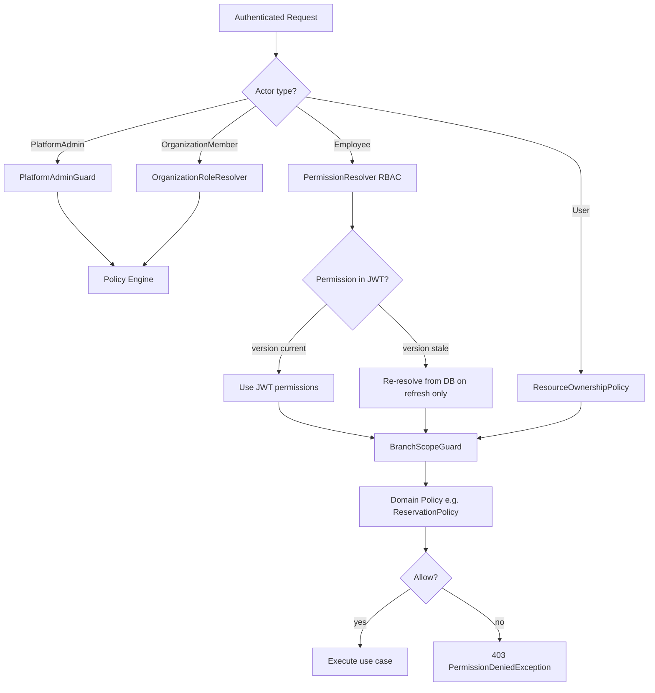

# AUTHORIZATION_ARCHITECTURE.md

# Enterprise Restaurant Reservation Platform

Version: 1.0  
Phase: **2.0.1 — Authorization Architecture** (documentation only; no implementation yet)

---

# Purpose

This document is the **single source of truth** for Authorization — what an authenticated principal is allowed to do, on which resources, and within which scope.

| Concern | Question | Owner document |
|---|---|---|
| **Authentication** | Who are you? | `AUTHENTICATION_ARCHITECTURE.md` |
| **Authorization** | What may you do? | **This document** |
| **Tenant isolation** | Which organization's data may you see? | `TENANCY.md` |

Authentication establishes identity and issues credentials. Authorization evaluates permissions, policies, scopes, and limits **after** identity is proven. These modules must not be merged.

Related documents: `DECISIONS.md` (ADR-017), `DOMAIN_MODEL.md`, `DATABASE_SCHEMA.md`, `EVENTS.md`, `TENANCY.md`.

---

# 1. Authorization Philosophy

## 1.1 Core Principles

1. **Fail closed** — if authorization cannot be determined, deny.
2. **Default deny** — no permission is implied; every protected action requires an explicit grant or policy allow.
3. **Separation from authentication** — JWT proves identity; guards and policies prove entitlement.
4. **Domain-first policies** — business modules depend on policy interfaces, not NestJS guards, in Application/Domain layers.
5. **Scope is not permission** — holding `reservations:approve` does not bypass branch scope; both must pass.
6. **Deny beats grant** — explicit revocations and deny rules override role defaults.
7. **Versioned, not infinitely cached** — permissions are embedded in short-lived JWTs with a version stamp; changes propagate on refresh, not on stale Redis caches.
8. **Extensible without redesign** — Phase 2 ships RBAC + policy classes; ABAC, feature flags, subscription limits, and temporal rules plug into the same Policy Engine interface.

## 1.2 What Authorization Is Not

| Not authorization | Belongs to |
|---|---|
| Password verification | Authentication |
| JWT signing / refresh rotation | Authentication |
| `organizationId` query scoping | Tenancy (Prisma extension) |
| Subscription usage counting | Subscription domain (authorization *consumes* limits) |
| Input validation | Presentation layer |

## 1.3 Module Layout (Phase 2+ Implementation Target)

```
apps/backend/src/modules/authorization/
├── domain/
│   ├── policies/              # ReservationPolicy, TablePolicy, … (interfaces + rules)
│   ├── services/              # PermissionResolver, PolicyEngine (interfaces)
│   ├── value-objects/         # PermissionSlug, ScopeContext, AuthorizationDecision
│   └── exceptions/              # PermissionDeniedException, ScopeViolationException
├── application/
│   ├── resolvers/             # RbacPermissionResolver, OrganizationRoleResolver
│   └── ports/                 # PermissionRepository, PolicyContextPort
├── infrastructure/
│   ├── persistence/           # Prisma permission queries
│   └── cache/                 # Optional request-scoped memoization only
└── presentation/
    ├── guards/                # PermissionsGuard, BranchScopeGuard, OrganizationMemberGuard
    └── decorators/            # @RequirePermission(), @RequirePolicy(), @RequireOrgRole()
```

Authentication module retains **only** `JwtAuthGuard` (identity). All entitlement checks live in Authorization.

---

# 2. RBAC Architecture

## 2.1 Two Layers (Unchanged from ADR-016, Owned Here)

| Layer | Storage | Scope | Resolver |
|---|---|---|---|
| **Organization administrative** | `OrganizationMember.role` enum | Organization | `OrganizationRoleResolver` |
| **Restaurant operational** | `Roles` + `Permissions` + `RolePermissions` | Restaurant / Branch | `PermissionResolver` (RBAC path) |

RBAC answers: *does this principal hold permission slug X?*  
Scope guards answer: *may they exercise it on this branch/resource?*  
Policies answer: *given business context, is this specific action allowed?*

## 2.2 Role Types

| Role source | Examples | Hierarchy |
|---|---|---|
| Platform | `PlatformAdmin` | Above all tenants |
| Organization member | `Owner` > `Admin` > `Billing` > `Staff` | Org-wide admin |
| Employee (operational) | `Manager` > `Receptionist`, `Cashier` | Restaurant ops (flat permission sets per role, not inheritance tree in Phase 2) |
| Implicit customer | `Customer` | No Employee record; resource-owner rules only |

## 2.3 Permission Slugs

Format: `<resource>:<action>` (e.g., `reservations:approve`, `tables:manage`).

Stored in `Permissions.slug`. Seeded at deploy; extended via migrations + seed, never hardcoded in business logic.

---

# 3. Permission Model

## 3.1 Entities (DATABASE_SCHEMA.md)

| Concept | Physical storage | Notes |
|---|---|---|
| Permission | `Permissions` | Atomic capability |
| Role | `Roles` | Grouping for employees |
| Role grant | `RolePermissions` where `type = RoleGrant` | Role → permission |
| Individual grant | `RolePermissions` where `type = IndividualGrant`, `employeeId` set | Employee override |
| Individual revocation | `RolePermissions` where `type = IndividualRevocation`, `employeeId` set | Deny override |
| Employee role | `Employees.roleId` → `Roles` | **Not** a separate `EmployeeRole` table |
| User permission | **No `UserPermission` table** | Employee overrides use `RolePermissions.employeeId`; org admin uses `OrganizationMember.role`; future ABAC uses `PermissionAssignment` (§21) |
| Permission version | `Users.permissionsVersion`, `Employees.permissionsVersion` | Bumped on any grant/revoke/role change |
| Session version | `Users.sessionVersion` | Bumped on global logout / security events (Authentication doc) |

## 3.2 Effective Permission Formula

For an **Employee**:

```
effectivePermissions =
    (RolePermissions[employee.roleId] where type = RoleGrant)
    ∪ IndividualGrants[employeeId]
    − IndividualRevocations[employeeId]
```

For **OrganizationMember** (admin actions):

```
allowed = OrganizationRoleMatrix[member.role].allows(action)
```

For **Customer** (`User`):

```
allowed = ResourceOwnershipPolicy OR public-action whitelist
```

---

# 4. Role Hierarchy

```
PlatformAdmin                    (platform scope — $systemContext only)
    │
OrganizationMember.Owner         (tenant admin — billing, members, restaurants)
    │
OrganizationMember.Admin
    │
OrganizationMember.Billing
    │
OrganizationMember.Staff
    │
    ├── Employee.Manager         (restaurant ops — broad operational set)
    ├── Employee.Receptionist
    └── Employee.Cashier
    │
Customer (User)                  (no org/employee role — owns own resources)
```

Hierarchy defines **organizational authority**, not automatic permission inheritance between operational roles. A Manager does not inherit Receptionist permissions implicitly — each role has an explicit permission set in seed data.

---

# 5. Permission Hierarchy

Permissions are **flat slugs**, grouped logically for documentation and UI:

| Namespace | Examples | Typical roles |
|---|---|---|
| `organization:*` | `organization:members:manage` | Owner, Admin |
| `restaurants:*` | `restaurants:manage` | Owner, Admin, Manager |
| `branches:*` | `branches:manage` | Manager |
| `reservations:*` | `reservations:create`, `reservations:approve` | Receptionist, Manager |
| `tables:*` | `tables:manage` | Manager |
| `employees:*` | `employees:manage` | Manager |
| `reports:*` | `reports:view` | Manager, Owner |
| `offers:*` | `offers:manage` | Manager |

Namespace depth is conventional (colon-separated); authorization checks a single slug unless a policy aggregates multiple.

---

# 6. Permission Resolution Flow



**Steps:**

1. `JwtAuthGuard` — identity only (Authentication).
2. `TenantContextInterceptor` — bind `organizationId` (Tenancy).
3. `PermissionsGuard` — slug in effective set?
4. `BranchScopeGuard` — resource branch in scope?
5. **Policy Engine** — domain rules (state, ownership, subscription, flags).
6. Use case executes.

---

# 7. Policy Engine Architecture

## 7.1 Interface (Domain)

```typescript
// Conceptual — not implementation code
interface AuthorizationPolicy<TContext> {
  authorize(actor: Principal, action: string, context: TContext): AuthorizationDecision;
}

type AuthorizationDecision = { allowed: true } | { allowed: false; reason: string; code: string };
```

## 7.2 Engine

`PolicyEngine` orchestrates:

1. Collect applicable policies for the action (registry by resource type).
2. Evaluate in order: **deny rules → scope → RBAC → ABAC (future) → subscription limits → feature flags**.
3. First hard deny wins; all applicable allows required where configured as `requireAll`.

Business use cases call:

```typescript
await this.policyEngine.assertAllowed('reservations:approve', actor, reservationContext);
```

Never embed `if (employee.role === 'Manager')` in use cases.

## 7.3 Registration

Each feature module registers its policies at module init. Authorization module owns the registry; feature modules own policy implementations.

---

# 8. Guard Architecture (Presentation)

Guards run **after** `JwtAuthGuard`. Order matters:

| Order | Guard | Module |
|---|---|---|
| 1 | `JwtAuthGuard` | Authentication |
| 2 | `TenantContextInterceptor` | Tenancy |
| 3 | `SessionVersionGuard` | Authentication |
| 4 | `PermissionsGuard` | Authorization |
| 5 | `BranchScopeGuard` | Authorization |
| 6 | `OrganizationMemberGuard` | Authorization |
| 7 | `PlatformAdminGuard` | Authorization |

Guards are thin: they read decorators + JWT claims and delegate to `PermissionResolver` / `PolicyEngine`. No database access in guards except via injected application services.

---

# 9. Decorator Architecture

| Decorator | Purpose | Example |
|---|---|---|
| `@RequirePermission('reservations:approve')` | RBAC slug required | Controller method |
| `@RequireAnyPermission(['a', 'b'])` | One of set | Read endpoints |
| `@RequireOrgRole('Owner', 'Admin')` | Organization admin role | Invite member |
| `@RequirePolicy(ReservationPolicy, 'approve')` | Domain policy | Complex rules |
| `@Public()` | Skip auth (login, register) | Auth controller |
| `@SkipAuthorization()` | Authenticated but no permission check | `/auth/me` |

Decorators set metadata only; guards enforce.

---

# 10. Ownership Rules

| Principal | Owns / may access | Mechanism |
|---|---|---|
| **Platform Admin** | Cross-tenant read/write (audited) | `PlatformAdmin` + `$systemContext` |
| **Organization Owner** | Organization, all restaurants under org, billing, members | `OrganizationMember.role = Owner` |
| **Organization Admin** | Members, restaurants; not ownership transfer alone | Org role matrix |
| **Restaurant Manager** (Employee) | Restaurant ops per role permissions + branch scope | RBAC + branch assignments |
| **Receptionist** | Reservations, limited table read | RBAC subset |
| **Cashier** | Payments/offers (future), read reservations | RBAC subset |
| **Customer** | Own profile, own reservations, own reviews | `userId` match on resource |
| **Reservation guest** | No account — staff creates on behalf | Staff permission, not customer JWT |

**Restaurant Owner (display):** the Organization member with `Owner` role — not a separate `Restaurant.ownerId` (ADR-011).

**Resource ownership check (customers):**

```
allowed ⇔ resource.userId === principal.userId
```

Staff bypass ownership only when holding the required permission slug **and** branch scope.

---

# 11. Tenant Scope Resolution

Handled by **TENANCY.md** (Prisma extension), not duplicated here.

Authorization assumes tenant context is already bound. Authorization adds:

* Verify JWT `organizationId` matches resource's organization (defense in depth).
* `PlatformAdmin` bypasses tenant scope only via `$systemContext`.

---

# 12. Branch Scope Resolution

```typescript
// Conceptual
function isBranchAllowed(employee: EmployeeContext, branchId: string): boolean {
  if (employee.branchIds.length === 0) return true; // restaurant-wide
  return employee.branchIds.includes(branchId);
}
```

Enforced by `BranchScopeGuard` + `EmployeeBranchAssignment` data.

Failure: `EmployeeBranchNotAssignedException` (403).

---

# 13. Organization Scope Resolution

Organization-scoped actions (invite member, view billing) require:

1. `actorType === OrganizationMember` (or Employee also being a member — rare).
2. `OrganizationMember.role` satisfies `OrganizationRoleMatrix` for the action.
3. `organizationId` in JWT matches target organization.

Employees without `OrganizationMember` record cannot perform org-admin actions even with operational permissions.

---

# 14. Permission Inheritance

| Type | Inherits? | Mechanism |
|---|---|---|
| Operational role → role | **No automatic inheritance** | Each role has explicit seed grants |
| Role → employee | **Yes** | `Employees.roleId` → `RolePermissions` |
| Org Owner → Admin | **No** | Separate enum capabilities |
| Customer → Employee | **No** | Separate actor types |

Future: `Roles.parentRoleId` may add inheritance; resolver would flatten transitive grants at resolve time.

---

# 15. Permission Overrides

Stored in `RolePermissions` with `employeeId`:

| Type | Effect |
|---|---|
| `IndividualGrant` | Adds permission not in role |
| `IndividualRevocation` | Removes permission despite role |

Overrides are audited via `PermissionGranted` / `PermissionRevoked` events and bump `Employees.permissionsVersion`.

---

# 16. Permission Deny Rules

Evaluation order:

1. **Explicit revocation** (`IndividualRevocation`) — always wins.
2. **Emergency lockdown** (§26) — denies all non-platform actions.
3. **Country restriction** (§25) — deny if branch country blocked.
4. **Subscription limit** (§22) — deny create actions when over limit.
5. **Feature flag off** (§21) — deny feature endpoints.
6. **RBAC missing grant** — deny.
7. **Policy deny** — domain rule rejection.

---

# 17. Permission Versioning

| Field | Location | Bumped when |
|---|---|---|
| `permissionsVersion` | `Users`, `Employees` | Role change, grant, revoke, branch assignment change |
| Embedded in JWT | Access token claim | At login / refresh |
| `DeviceSession.permissionsVersion` | Snapshot at issue | Audit only |

**Stale access token:** if `JWT.permissionsVersion < current`, token still valid until expiry (≤15 min). Refresh always re-resolves.

**Never:** long-lived Redis cache as source of truth for permissions (NON_FUNCTIONAL_REQUIREMENTS.md).

---

# 18. Permission Cache Strategy

| Cache | Allowed? | TTL | Invalidation |
|---|---|---|---|
| JWT claims | Yes | Access token TTL | Refresh / version bump |
| Request-scoped memo | Yes | Single request | Automatic |
| Redis permission cache | **No** (Phase 2) | — | — |
| In-process LRU | **No** | — | — |

Optional future: Redis cache keyed by `(userId, permissionsVersion)` — only when version matches DB; still re-check version on each request.

---

# 19. Policy Classes

Each policy exposes a simple decision interface. Application services depend on policies, not guards.

| Policy | Responsibilities |
|---|---|
| `ReservationPolicy` | Status transitions, cancellation window, party size, branch scope, phone-reservation rules |
| `RestaurantPolicy` | Suspended restaurant, subscription active, org membership |
| `TablePolicy` | Merge/split, floor-plan edits, disabled table |
| `EmployeePolicy` | Invite, assign role, branch assignment, cannot remove last manager |
| `OfferPolicy` | Publish, expire, branch eligibility |
| `ReviewPolicy` | Owner reply, delete, customer owns review |
| `SubscriptionPolicy` | Plan limits, downgrade rules, feature gating |
| `AnalyticsPolicy` | Role-based report access, PII masking |
| `OrganizationPolicy` | Owner transfer, member invite/remove, sole Owner invariant |
| `FilePolicy` | Public vs private bucket, owner upload |

**Example (conceptual):**

```typescript
ReservationPolicy.canApprove(actor, reservation):
  require permission 'reservations:approve'
  require branch scope reservation.branchId
  require reservation.status === Pending
  require restaurant not suspended
  require subscription allows reservations
```

---

# 20. Future ABAC Integration

Attribute-Based Access Control extends RBAC without replacing it.

**Phase 3+ attributes:**

* Resource attributes: `reservation.status`, `restaurant.tier`, `branch.countryCode`
* Actor attributes: `employee.tenure`, `organization.plan`
* Environment: time of day, IP country, emergency mode

**Integration point:** `PolicyEngine` evaluates ABAC rules after RBAC pass. Rules stored in `AuthorizationRule` table (future) or configuration service.

```
RBAC (coarse) → ABAC (fine) → Deny rules
```

RBAC remains the fast path; ABAC handles dynamic conditions RBAC cannot express.

---

# 21. Feature Flag Integration

`FeatureFlags` table (DATABASE_SCHEMA.md) storage; evaluation in Policy Engine.

```
if (!featureFlags.isEnabled('offers', organizationId)) deny
```

Flags never bypass authentication. Disabled feature → `403` with `FEATURE_DISABLED`.

---

# 22. Subscription-based Authorization

`SubscriptionValidator` (DOMAIN_MODEL.md) enforces plan limits **before** resource creation.

Authorization flow:

1. RBAC: does actor hold `restaurants:create`?
2. Subscription policy: is `organization.usage.restaurants < plan.maxRestaurants`?

Limit exceeded → `OrganizationLimitExceededException` (403).

Usage counters are incremental (domain events), not live `COUNT(*)`.

---

# 23. Temporary Permissions

**Future table:** `PermissionAssignment`

| Field | Purpose |
|---|---|
| `principalId` | User or Employee |
| `permissionId` | Granted permission |
| `validFrom` / `validUntil` | Time window |
| `grantedBy` | Auditor |
| `reason` | Ticket reference |

Resolver includes grant only if `now ∈ [validFrom, validUntil]`.

Use cases: temporary Manager coverage, support access (audited).

---

# 24. Time-based Permissions

Examples:

* `employees:approve-reservations` only during `branch.workingHours`
* Scheduled offer publish — `OfferPolicy` + working schedule

Implemented in domain policies using `ClockPort` — not in guards.

---

# 25. Country-based Restrictions

Branch carries `countryCode`. Policy rules may deny actions when:

* Organization's markets exclude a country.
* Sanctions/compliance list (platform config).

```
CountryRestrictionPolicy.assertAllowed(actor, branch.countryCode)
```

Failures audited; may trigger `SecurityAlertRaised`.

---

# 26. Emergency Lockdown Mode

**`SystemConfiguration.emergencyLockdown`** (boolean).

When `true`:

* All staff operational permissions denied except `platform:lockdown:bypass` (Platform Admin).
* Customers may still view own reservations (read-only) unless config says otherwise.
* Existing sessions: `sessionVersion` bump optional on activation.

Toggle audited as `SecurityAlertRaised` with severity `critical`.

---

# Authorization Flow Summary

```
Identity proven (Authentication)
    → Tenant bound (Tenancy)
    → Session version valid (Authentication)
    → RBAC slug present (Authorization)
    → Scope valid: org / branch (Authorization)
    → Domain policy allows (Authorization / Policy Engine)
    → Subscription / feature flag / temporal rules (Authorization)
    → Use case executes
```

---

# Open Decisions (Deferred)

| Topic | Status | Notes |
|---|---|---|
| RS256 vs HS256 for JWT | Open | Authentication; does not affect authorization model |
| `Roles.parentRoleId` inheritance | Deferred | Seed flat roles in Phase 2 |
| Redis permission cache with version key | Deferred | Phase 3+ if profiling requires |
| `AuthorizationRule` ABAC table schema | Deferred | Policy Engine interface ready |
| Per-endpoint vs per-use-case policy invocation | **Decided:** use case level | Controllers stay thin |

---

# Approval

**Status:** ✅ Accepted (ADR-017). Phase 2.1 RBAC seed and Phase 2.2 domain layer complete; NestJS guards and Policy Engine wiring in Phase 2.13+.

Do not implement Authorization or Authentication code until ADR-016, ADR-017, and both architecture documents are approved.
